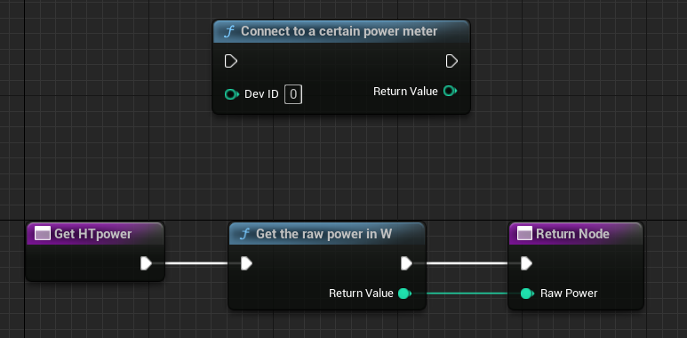

# Intro

- [x] Works with Unreal 5.1 on Windows
- [ ] Adapt CMake for Mac/ Linux targets
- [ ] Test on macOS
- [ ] Test on Linux

In the current state this library only works on Windows, and can connect to a single home trainer (FEC device) of a user-defined device ID (see ANT+ documentation).

The project was used in CLion IDE.

For commercial purposes please contact me :-)

## Using in UE-5

Important points for UE compatibility:

- Needs to be compiled for Windows with the MS BuildTools toolset using architecture x64
- Needs to be a Release build (if not, UE will complain at link time)

## Steps for using the plugin

if you don't have / know CMake, you'll need a fresh installation of it:
<https://cmake.org/download/>

As well as ninja:
<https://ninja-build.org/>

- Run the CMake initiate command (see section below)
- Run the CMake build command
- Run the CMake install command 

The CMake install step will place the compiled libraries in the `AntPlusPlugin` folder. 
So you should have two .lib files in AntPlusPlugin/Source/ThirdParty/AntPlusPluginLibrary/x64

- Copy the entire `AntPlusPlugin` folder to your UE project `Plugins` folder
- Compile your project code from your Unreal engine main project window: <https://forums.unrealengine.com/t/ue5-compile-and-live-coding-button/232894/4>

New functions are now available for your blueprints:

```c
    UFUNCTION(BlueprintCallable, meta = (DisplayName = "Connect to a certain power meter", Keywords = "AntPlusPlugin power meter connect"), Category = "AntPlusPlugin")
    static int connectPowerMeterDeviceID(int devID);

    UFUNCTION(BlueprintCallable, meta = (DisplayName = "Get the raw power in W", Keywords = "AntPlusPlugin power get"), Category = "AntPlusPlugin")
    static int getRawPower();

    UFUNCTION(BlueprintCallable, meta = (DisplayName = "Send bytes to the ANT+ channel", Keywords = "AntPlusPlugin bytes send"), Category = "AntPlusPlugin")
    static void sendBytes(int page, int byte1, int byte2, int byte3, int byte4, int byte5, int byte6, int byte7);

    UFUNCTION(BlueprintCallable, meta = (DisplayName = "Set the FEC trainer target power", Keywords = "AntPlusPlugin FEC target power"), Category = "AntPlusPlugin")
    static void setFECPage49(float targetPower);

    UFUNCTION(BlueprintCallable, meta = (DisplayName = "Set the FEC trainer target slope", Keywords = "AntPlusPlugin FEC target slope"), Category = "AntPlusPlugin")
    static void setFECPage51(float targetSlope, float targetResistance);
```



First, set your power meter sensor device ID (16 bits unsigned).

In your code you can then call the second block to read the last received power from the sensor.

## Build commands

Initiate CMake build

```bash
cmake -DCMAKE_BUILD_TYPE=Release -S . -B cmake-build-release -G "Visual Studio 16 2019" -A x64 -G Ninja
```

or 

```bash
cmake -DCMAKE_BUILD_TYPE=Release -S . -B cmake-build-release -G "Visual Studio 16 2019" -A x64 -G "MinGW Makefiles"
```

Build

```bash
cmake --build cmake-build-release --target ant_test_DLL -j 12
```

Install libraries in tree

```bash
cmake --build cmake-build-release --target install -j 12
```